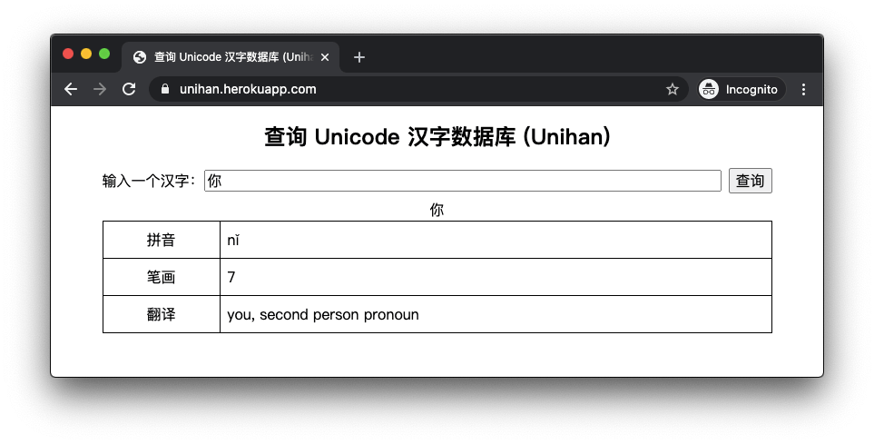

# A website and API for Unihan database

https://unihan.herokuapp.com/



## API

The API endpoint is `https://unihan.herokuapp.com/api/unihan`. Use the `q` query
parameter to supply the character itself or its codepoint, for example, to query
`你`, both of these works

- https://unihan.herokuapp.com/api/unihan?q=%E6%9F%A5
- https://unihan.herokuapp.com/api/unihan?q=0x4f60

Here is an example response:

```
$ curl -i 'https://unihan.herokuapp.com/api/unihan?q=%E6%9F%A5'
HTTP/1.1 200 OK
Server: Cowboy
Connection: keep-alive
Content-Type: application/json
Access-Control-Allow-Origin: *
Cache-Control: public, max-age=604800, immutable
Date: Mon, 10 Aug 2020 09:43:05 GMT
Content-Length: 1439
Via: 1.1 vegur

{
  "kCowles": "405",
  "kDaeJaweon": "0908.060",
  "kHanYu": "21181.070",
  "kIRGDaeJaweon": "0908.060",
  "kIRGDaiKanwaZiten": "14643",
  "kIRGHanyuDaZidian": "21181.070",
  "kIRGKangXi": "0520.070",
  "kKangXi": "0520.070",
  "kLau": "167",
  "kMatthews": "103",
  "kMorohashi": "14643",
  "kSBGY": "093.37 169.20",
  "kCangjie": "DAM",
  "kCihaiT": "687.404",
  "kFourCornerCode": "4010.7",
  "kFrequency": "3",
  "kHKGlyph": "1890",
  "kPhonetic": "13 97",
  "kUnihanCore2020": "GHMT",
  "kIICore": "AGTHM",
  "kIRG_GSource": "G0-3269",
  "kIRG_HSource": "HB1-AC64",
  "kIRG_KPSource": "KP1-4B03",
  "kIRG_TSource": "T1-5167",
  "kIRG_VSource": "V1-595F",
  "kRSUnicode": "75.5",
  "kTotalStrokes": "9",
  "kBigFive": "AC64",
  "kCCCII": "21443A",
  "kCNS1986": "1-5167",
  "kCNS1992": "1-5167",
  "kEACC": "21443A",
  "kGB0": "1873",
  "kGB1": "1873",
  "kKPS1": "4B03",
  "kMainlandTelegraph": "2686",
  "kTGH": "2013:1431",
  "kTaiwanTelegraph": "2686",
  "kXerox": "244:354",
  "kRSKangXi": "75.5",
  "kCantonese": "caa4 zaa1",
  "kDefinition": "investigate, examine, seek into",
  "kHanyuPinlu": "chá(470)",
  "kHanyuPinyin": "21181.070:chá,zhā,chái",
  "kJapaneseKun": "SHIRABERU",
  "kJapaneseOn": "SA",
  "kKorean": "SA",
  "kMandarin": "chá",
  "kTGHZ2013": "034.130:chá 461.190:zhā",
  "kVietnamese": "tra",
  "kXHC1983": "0113.030:chá 1447.030:zhā",
  "kSemanticVariant": "U+67FB<kMatthews",
  "codepoint": 26597
}
```
