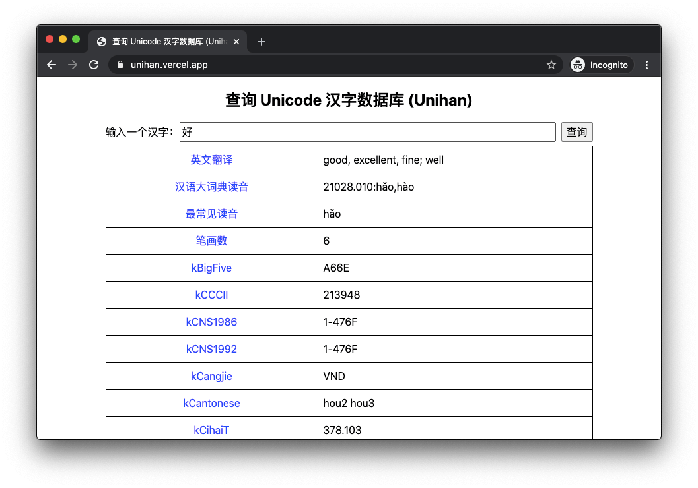

# A website and API for Unihan database

https://unihan.vercel.app/



## API

The API endpoint is `https://unihan.vercel.app/api/unihan`. Use the `q` query
parameter to supply the character itself, for example, to query `好`:

- https://unihan.vercel.app/api/unihan?q=好

Here is an example response:

```
$ curl -i 'https://unihan.vercel.app/api/unihan?q=好'
HTTP/2 200
content-type: application/json; charset=utf-8
cache-control: max-age=0
date: Wed, 19 Aug 2020 06:04:50 GMT
access-control-allow-origin: *
etag: W/"621-xeFsz5Bs+nKsE7Lxr+2iKMme2HA"
content-length: 1569
x-vercel-cache: HIT
age: 290
server: Vercel
x-vercel-id: hkg1::sfo1::f9htm-1597817380715-66680e361cb9
strict-transport-security: max-age=63072000; includeSubDomains; preload

{
  "kCowles": "1099 1100",
  "kDaeJaweon": "0518.120",
  "kFennIndex": "150.10 151.01 151.03",
  "kGSR": "1044a",
  "kHanYu": "21028.010",
  "kIRGDaeJaweon": "0518.120",
  "kIRGDaiKanwaZiten": "06053",
  "kIRGHanyuDaZidian": "21028.010",
  "kIRGKangXi": "0255.110",
  "kKangXi": "0255.110",
  "kLau": "1193 1194",
  "kMatthews": "2062",
  "kMeyerWempe": "741 742",
  "kMorohashi": "06053",
  "kNelson": "1191",
  "kSBGY": "303.08 419.01",
  "kCangjie": "VND",
  "kCihaiT": "378.103",
  "kFenn": "552A",
  "kFourCornerCode": "4744.7",
  "kFrequency": "1",
  "kGradeLevel": "1",
  "kHKGlyph": "0871",
  "kPhonetic": "481",
  "kUnihanCore2020": "GHJKMPT",
  "kIICore": "AGTJHKMP",
  "kIRG_GSource": "G0-3A43",
  "kIRG_HSource": "HB1-A66E",
  "kIRG_JSource": "J0-3925",
  "kIRG_KPSource": "KP0-F3F8",
  "kIRG_KSource": "K0-7B3F",
  "kIRG_TSource": "T1-476F",
  "kIRG_VSource": "V1-515F",
  "kRSUnicode": "38.3",
  "kTotalStrokes": "6",
  "kBigFive": "A66E",
  "kCCCII": "213948",
  "kCNS1986": "1-476F",
  "kCNS1992": "1-476F",
  "kEACC": "213948",
  "kGB0": "2635",
  "kGB1": "2635",
  "kJis0": "2505",
  "kJoyoKanji": "2010",
  "kKPS0": "F3F8",
  "kKSC0": "9131",
  "kKoreanEducationHanja": "2007",
  "kMainlandTelegraph": "1170",
  "kTGH": "2013:581",
  "kTaiwanTelegraph": "1170",
  "kXerox": "241:114",
  "kRSAdobe_Japan1_6": "C+1975+38.3.3 C+1975+39.3.3",
  "kRSKangXi": "38.3",
  "kCantonese": "hou2 hou3",
  "kDefinition": "good, excellent, fine; well",
  "kHangul": "호:0E",
  "kHanyuPinlu": "hǎo(6060) hāo(142) hào(115)",
  "kHanyuPinyin": "21028.010:hǎo,hào",
  "kJapaneseKun": "KONOMU SUKU YOI",
  "kJapaneseOn": "KOU",
  "kKorean": "HO",
  "kMandarin": "hǎo",
  "kTGHZ2013": "132.140:hǎo 133.010:hào",
  "kTang": "*xɑ̀u *xɑ̌u",
  "kVietnamese": "háo",
  "kXHC1983": "0445.030:hǎo 0448.030:hào",
  "char": "好"
}
```
